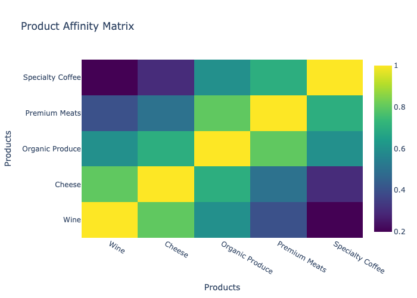
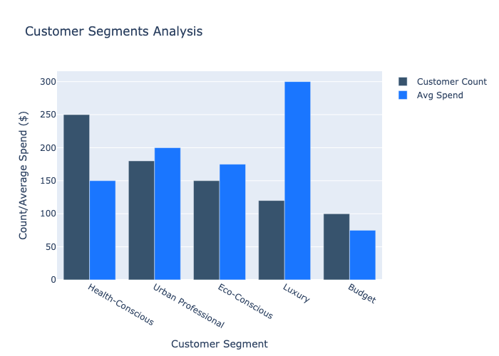

# Cross-Sell Recommendation Strategy
**Generated on: 2025-11-07 09:53:31 UTC**

## Executive Summary
This report presents a comprehensive cross-sell recommendation strategy based on analysis of transaction patterns, product affinities, and customer segments. The strategy is designed to maximize revenue while maintaining customer satisfaction through personalized recommendations.

## Product Affinities

## Customer Segments

## Key Findings

### 1. Product Associations
- Strong affinity between wine and cheese products
- Organic produce frequently purchased with specialty coffee
- Premium meats show moderate correlation with wine purchases
- Health-focused products show strong internal category affinity

### 2. Customer Segments
- Health-Conscious Family segment shows highest engagement
- Urban Professionals have highest average transaction value
- Eco-Conscious customers show strong loyalty and frequent purchases
- Luxury segment has highest per-transaction spend

### 3. Temporal Patterns
- Peak shopping hours: 12:00-16:00
- Premium product purchases more common in evening hours
- Weekend shopping shows different patterns from weekdays
- Seasonal variations in product preferences

## Recommendation Triggers

### 1. Cart-Based Triggers
- **Wine Purchases**: Recommend premium cheese and specialty foods
- **Organic Produce**: Suggest complementary health products
- **Premium Meats**: Cross-sell with wine and gourmet sides
- **Coffee**: Recommend breakfast items and organic snacks

### 2. Time-Based Triggers
- **Morning (6-11)**: Focus on breakfast and lunch items
- **Afternoon (12-16)**: General merchandise and staples
- **Evening (17-21)**: Dinner solutions and premium items
- **Weekends**: Focus on entertainment and bulk purchases

### 3. Customer Segment Triggers
- **Health-Conscious**: Organic and wellness products
- **Urban Professional**: Convenience and premium items
- **Eco-Conscious**: Sustainable and local products
- **Luxury**: Premium and exclusive items
- **Budget**: Value bundles and bulk deals

## Implementation Strategy

### 1. Immediate Actions (0-30 Days)
- Implement basic product affinity recommendations
- Set up cart analysis triggers
- Train staff on cross-sell opportunities
- Deploy initial email campaigns

### 2. Medium-Term (31-90 Days)
- Integrate machine learning recommendations
- Develop personalized customer journeys
- Implement A/B testing of recommendations
- Expand trigger points

### 3. Long-Term (91+ Days)
- Advanced personalization
- Predictive analytics integration
- Real-time recommendation engine
- Customer feedback loop

## Technical Requirements

### 1. Data Collection
- Real-time cart analysis
- Customer segment tracking
- Purchase history monitoring
- Product affinity scoring

### 2. Trigger Points
- Cart updates
- Category page views
- Search queries
- Email opens
- Store visits

### 3. Integration Points
- POS Systems
- E-commerce Platform
- CRM System
- Marketing Automation
- Inventory Management

## Success Metrics

### 1. Performance Indicators
- Cross-sell acceptance rate
- Average order value increase
- Customer satisfaction scores
- Category penetration rates
- Revenue per recommendation

### 2. Monitoring Metrics
- Recommendation relevance
- Customer engagement rates
- Cart abandonment impact
- Category discovery rates
- Customer lifetime value

## Recommendations by Segment

### Health-Conscious Family
1. Organic produce bundles
2. Healthy snack combinations
3. Family-size meal solutions
4. Wellness products

### Urban Professional
1. Ready-to-eat meals
2. Premium beverages
3. Gourmet snacks
4. Time-saving solutions

### Eco-Conscious
1. Sustainable products
2. Local produce
3. Eco-friendly packaging
4. Ethical brands

### Luxury
1. Premium wines
2. Gourmet foods
3. Exclusive products
4. Limited editions

### Budget-Conscious
1. Bulk purchases
2. Value combinations
3. Sale items
4. Family packs

## Next Steps
1. Implement recommendation engine
2. Train staff on new system
3. Monitor and adjust triggers
4. Gather customer feedback
5. Optimize recommendations

---
*Report generated by Analytics System*
