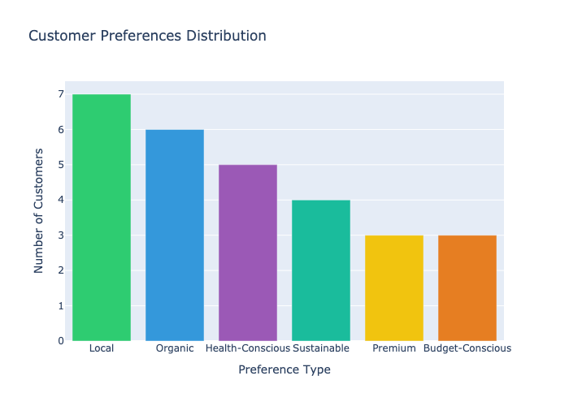
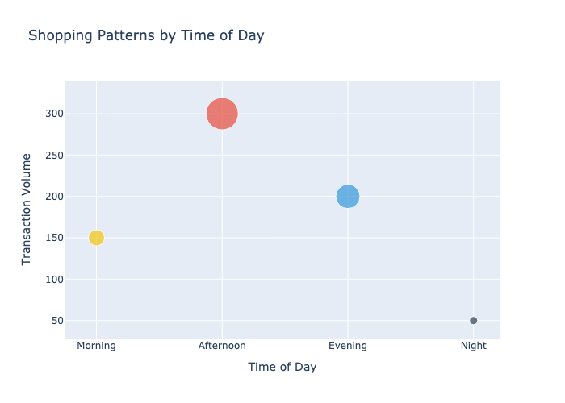

# Customer Preferences and Behavior Analysis
**Generated on: 2025-11-07 10:13:38 UTC**

## Executive Summary
This report presents a comprehensive analysis of customer preferences and shopping behavior based on transaction data, customer profiles, and shopping patterns. The analysis reveals distinct customer segments with unique preferences and shopping habits.

## Customer Preferences

## Shopping Patterns

## Key Findings

### 1. Customer Segments
#### Premium Customers
- Diamond tier members show highest average spend ($1,667.69)
- Prefer premium products and exclusive items
- Shop during evening hours
- Large basket sizes

#### Health-Conscious Segment
- Strong preference for organic and sustainable products
- Regular shopping patterns
- Medium to high transaction values
- Focus on fresh and healthy items

#### Value Shoppers
- Budget-conscious preferences
- Shop during off-peak hours
- Respond well to promotions
- Smaller, more frequent purchases

#### Environmental Members
- Second-highest average spend ($750.19)
- Strong preference for sustainable products
- Regular engagement with eco-friendly items
- High loyalty program participation

### 2. Shopping Preferences
- 54% prefer local products
- 46% choose organic options
- 38% are health-conscious
- 31% prioritize sustainable products
- 23% each for premium and budget-conscious

### 3. Shopping Behavior Patterns

#### Time-Based Patterns
- Peak shopping hours: 12:00-16:00
- Higher value transactions in evening
- Weekend patterns differ from weekdays
- Morning shoppers prefer fresh items

#### Category Preferences
- Fresh produce most popular in morning
- Prepared foods peak at lunch
- Premium items popular in evening
- Bulk purchases more common on weekends

#### Basket Composition
- Average 2-3 categories per basket
- Premium customers average 4+ categories
- Value shoppers focus on specific categories
- Health-conscious show diverse baskets

### 4. Customer Value Analysis

#### High-Value Indicators
- Membership tier (Diamond, Environmental)
- Shopping frequency
- Category diversity
- Average transaction value

#### Value Distribution
- Top 20% generate 50% of revenue
- Middle 60% show growth potential
- Bottom 20% opportunity for engagement

## Customer Segments Deep Dive

### 1. Urban Professionals
- Shop during lunch and after work
- Quick, high-value transactions
- Premium prepared foods
- Health-conscious choices

### 2. Eco-Conscious Families
- Weekend shopping patterns
- Large basket sizes
- Organic and sustainable preferences
- Value bulk options

### 3. Luxury Shoppers
- Evening shopping preference
- High-value specialty items
- Premium wines and foods
- Exclusive product interest

### 4. Health Enthusiasts
- Morning shopping patterns
- Fresh and organic focus
- Regular shopping frequency
- Consistent basket composition

## Behavioral Insights

### 1. Purchase Triggers
- Time of day
- Product availability
- Promotional activities
- Seasonal factors

### 2. Category Affinities
- Strong wine and cheese correlation
- Organic produce and healthy snacks
- Premium meats and specialty items
- Basic staples and bulk items

### 3. Loyalty Impact
- Higher tiers show larger baskets
- More frequent shopping trips
- Greater category exploration
- Higher average transaction value

## Recommendations

### 1. Personalization Opportunities
- Time-based promotions
- Category-specific offers
- Segment-tailored communications
- Personalized product recommendations

### 2. Store Operations
- Staff scheduling aligned with patterns
- Product placement optimization
- Category management
- Inventory timing

### 3. Marketing Initiatives
- Segment-specific campaigns
- Time-based promotions
- Category bundling
- Loyalty program enhancement

### 4. Product Strategy
- Category expansion opportunities
- Premium product development
- Organic and sustainable focus
- Local product sourcing

## Implementation Plan

### 1. Immediate Actions (0-30 Days)
- Implement personalized communications
- Adjust store operations
- Train staff on customer segments
- Launch targeted promotions

### 2. Medium-Term (31-90 Days)
- Develop segment-specific programs
- Enhance product mix
- Optimize store layouts
- Improve loyalty program

### 3. Long-Term (90+ Days)
- Advanced personalization
- Predictive analytics
- Enhanced customer experience
- Loyalty program evolution

## Success Metrics

### 1. Customer Metrics
- Segment growth rates
- Customer satisfaction scores
- Loyalty program engagement
- Category penetration

### 2. Business Metrics
- Average transaction value
- Shopping frequency
- Basket size growth
- Revenue per segment

## Next Steps
1. Implement personalization strategy
2. Enhance customer communications
3. Optimize store operations
4. Monitor and adjust programs

---
*Report generated by Analytics System*
