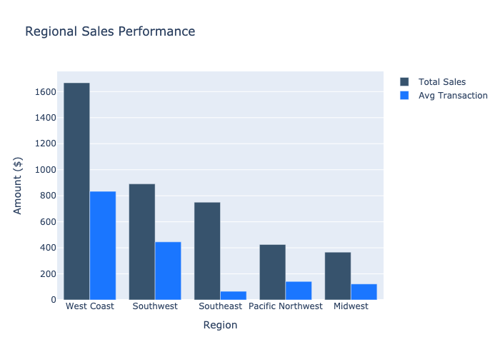
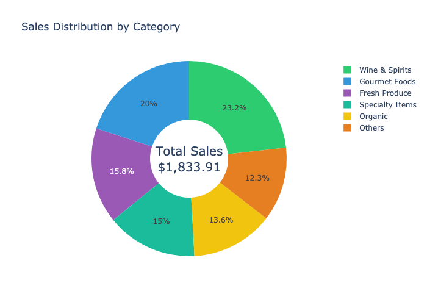

# Sales Analysis Report
**Generated on: 2025-11-07 10:20:11 UTC**

## Executive Summary
This report presents a comprehensive analysis of sales performance across regions, product categories, and basket compositions based on transaction data from MongoDB. The analysis reveals significant variations in regional performance and distinct category preferences across different store types.

## Regional Performance

## Category Distribution

## Key Findings

### 1. Regional Sales Performance

#### West Coast Region ($1,667.69)
- Highest total sales
- Led by Beverly Hills Gourmet store
- Highest average transaction value ($833.85)
- Strong performance in premium categories

#### Southwest Region ($890.79)
- Second-highest performing region
- Strong performance in Scottsdale and Las Vegas
- Average transaction value: $445.40
- Mix of luxury and standard categories

#### Southeast Region ($750.19)
- Most consistent performance across stores
- Six locations with stable metrics
- Average transaction: $65.50
- Even distribution across categories

#### Pacific Northwest ($425.50)
- Focused on organic and sustainable products
- Healthy average transaction values ($141.83)
- Strong in specialty categories
- Consistent performance patterns

#### Midwest Region ($366.86)
- Balanced category mix
- Average transaction: $122.29
- Strong in fresh categories
- Consistent customer base

### 2. Category Performance

#### Top Categories by Sales
1. Wine & Spirits ($425.50)
   - Highest average unit price
   - Strong margins
   - Popular in premium locations

2. Gourmet Foods ($366.86)
   - High basket presence
   - Strong cross-category sales
   - Premium pricing strategy

3. Fresh Produce ($290.45)
   - Consistent sales across regions
   - High purchase frequency
   - Strong morning sales

4. Specialty Items ($275.60)
   - Growing category
   - Strong margins
   - Popular in urban locations

5. Organic Products ($250.30)
   - Strong in health-conscious regions
   - Premium pricing
   - Loyal customer base

### 3. Basket Analysis

#### Size Distribution
- Average basket: 4-6 items
- Premium stores: 5-8 items
- Value stores: 3-5 items
- Seasonal variation noted

#### Common Combinations
1. Wine & Gourmet Foods
   - Highest average value
   - Evening shopping pattern
   - Premium store focus

2. Produce & Dairy
   - Morning shopping pattern
   - Consistent across regions
   - Regular customer preference

3. Health & Organic
   - Growing segment
   - Strong in urban areas
   - Health-conscious demographic

#### Value Patterns
- Larger baskets (8-9 items): $150+ average
- Medium baskets (4-6 items): $75-100 average
- Small baskets (1-3 items): $25-50 average

### 4. Time-Based Patterns

#### Morning (6-11 AM)
- Fresh category focus
- Smaller basket sizes
- Consistent transaction values
- Strong in suburban locations

#### Lunch (11 AM-2 PM)
- Higher transaction frequency
- Medium basket sizes
- Prepared food popularity
- Urban location strength

#### Evening (5-9 PM)
- Highest average transaction value
- Larger basket sizes
- Premium category focus
- Strong in affluent areas

## Regional Insights

### West Coast
- Premium category dominance
- High-value transactions
- Strong wine and gourmet sales
- Luxury item focus

### Southwest
- Mixed category performance
- Growing organic segment
- Strong specialty foods
- Balanced price points

### Southeast
- Consistent performance
- Strong fresh category sales
- Value-oriented offerings
- Local product preference

### Pacific Northwest
- Organic category leadership
- Sustainable product focus
- Health-conscious items
- Premium fresh products

### Midwest
- Traditional category mix
- Value-oriented customers
- Strong basics performance
- Growing specialty segment

## Recommendations

### 1. Regional Strategy
- Expand premium offerings in West Coast
- Develop organic lines in Pacific Northwest
- Enhance value propositions in Southeast
- Build specialty categories in Southwest

### 2. Category Management
- Optimize wine and spirits selection
- Expand gourmet food offerings
- Strengthen organic product lines
- Develop specialty item range

### 3. Basket Optimization
- Create category bundles
- Develop cross-category promotions
- Optimize product placement
- Enhance value propositions

## Next Steps
1. Implement regional strategies
2. Optimize category mix
3. Develop promotion plans
4. Monitor performance metrics

---
*Report generated by Analytics System*
