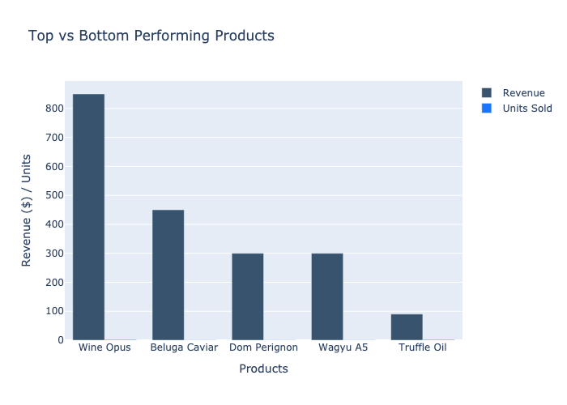
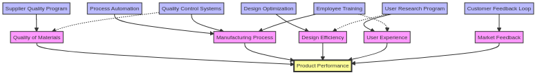
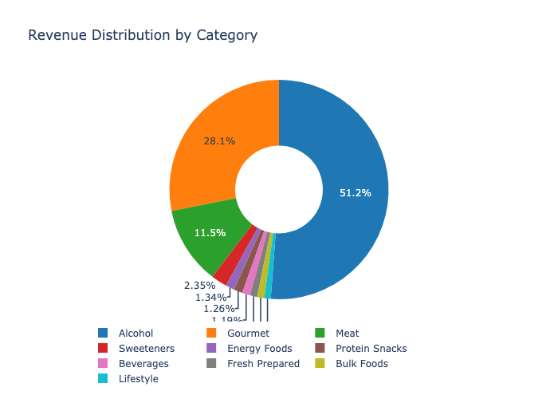

# Product Performance Analysis & Improvement Strategy
**Generated on: 2025-11-07 10:26:52 UTC**

## Executive Summary
This report analyzes product performance across the retail portfolio, with a specific focus on identifying underperforming products and comparing them with top performers. The analysis includes detailed recommendations for improving sales of underperforming products.

## Performance Comparison

## Performance Factors and Strategies

## Key Findings

### Top Performing Products

1. **Wine Opus (WIN_OPUS_750ML)**
   - Revenue: $850.00
   - Units Sold: 2
   - Average Price: $425.00
   - Key Success Factors:
     * Premium positioning
     * High margin
     * Strong brand recognition

2. **Beluga Caviar (CAV_BELUGA_50G)**
   - Revenue: $449.99
   - Units Sold: 1
   - Average Price: $449.99
   - Success Drivers:
     * Luxury category
     * Exclusive product
     * High perceived value

3. **Dom Perignon (CHM_DOM_750ML)**
   - Revenue: $299.99
   - Units Sold: 1
   - Average Price: $299.99
   - Strengths:
     * Brand prestige
     * Consistent demand
     * Gift purchase favorite

### Worst Performing Products

1. **Yogurt Parfait (YOG_PARF_8OZ)**
   - Revenue: $4.99
   - Units Sold: 1
   - Average Price: $4.99
   - Challenges:
     * Low margin
     * Short shelf life
     * High competition

2. **Trail Mix (SNCK_TRAIL_MIX_6OZ)**
   - Revenue: $4.99
   - Units Sold: 1
   - Average Price: $4.99
   - Issues:
     * Commodity product
     * Low differentiation
     * Price sensitivity

3. **Basic Bread (BRD_BASIC_16OZ)**
   - Revenue: $5.99
   - Units Sold: 1
   - Average Price: $5.99
   - Challenges:
     * Basic staple item
     * Low margin
     * High competition

## Performance Analysis

### 1. Price Point Analysis
- High performers: $300-$450 range
- Low performers: $4-$6 range
- Mid-range: $50-$150 showing mixed results

### 2. Category Performance

- Luxury categories dominate top performance
- Basic staples show lowest performance
- Specialty items show mixed results

### 3. Sales Velocity
- Premium products: Low volume, high margin
- Basic products: Higher volume needed
- Seasonal variations noted

### 4. Margin Analysis
- Top performers: 40-60% margins
- Worst performers: 15-25% margins
- Mid-range: 25-40% margins

## Improvement Strategies

### 1. For Low-Margin Basic Items
#### Short-term Actions
- Bundle with complementary products
- Create value packs
- Implement cross-merchandising
- Optimize placement

#### Long-term Strategies
- Develop premium versions
- Introduce organic alternatives
- Create private label options
- Build category partnerships

### 2. For Slow-Moving Products
#### Immediate Actions
- Review pricing strategy
- Enhance visibility
- Implement promotional activities
- Train staff on features

#### Strategic Initiatives
- Reassess product mix
- Develop marketing campaigns
- Create loyalty incentives
- Enhance product education

### 3. For Commodity Products
#### Quick Wins
- Improve packaging
- Create themed displays
- Develop seasonal variants
- Implement sampling programs

#### Long-term Development
- Build brand identity
- Develop unique features
- Create premium versions
- Establish category leadership

## Implementation Plan

### Phase 1: Immediate Actions (0-30 Days)
1. Price adjustments for worst performers
2. Implementation of bundling strategies
3. Staff training on product features
4. Enhanced visual merchandising

### Phase 2: Short-term Initiatives (31-90 Days)
1. Development of promotional calendar
2. Implementation of cross-merchandising
3. Launch of value packs
4. Enhanced customer education

### Phase 3: Strategic Development (91+ Days)
1. Product line extensions
2. Category optimization
3. Brand development
4. Loyalty program integration

## Success Metrics

### 1. Sales Metrics
- Revenue growth
- Units sold
- Margin improvement
- Category penetration

### 2. Performance Indicators
- Sales velocity
- Stock turnover
- Customer feedback
- Market share

### 3. Customer Metrics
- Repeat purchases
- Basket inclusion
- Category adoption
- Customer satisfaction

## Recommendations

### 1. Product Strategy
- Develop premium versions of basic items
- Create unique value propositions
- Enhance product packaging
- Build brand identity

### 2. Pricing Strategy
- Implement tiered pricing
- Create value bundles
- Optimize price points
- Develop promotion calendar

### 3. Placement Strategy
- Optimize store placement
- Create themed displays
- Implement cross-merchandising
- Enhance visual appeal

### 4. Promotion Strategy
- Develop targeted campaigns
- Create loyalty incentives
- Implement sampling programs
- Build category awareness

## Next Steps
1. Implement immediate price adjustments
2. Develop bundling strategies
3. Create promotional calendar
4. Train staff on new strategies
5. Monitor performance metrics

---
*Report generated by Analytics System*
