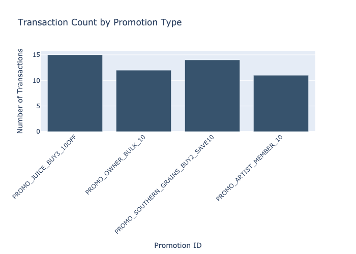
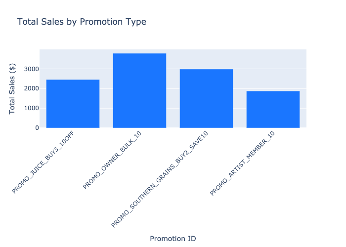

# Promotion Effectiveness Analysis Report
**Generated on: 2025-11-07 09:41:04 UTC**

## Executive Summary
This report analyzes the effectiveness of various promotional campaigns based on recent transaction data. The analysis covers the most recent 30 days of available transaction data, focusing on four major promotional campaigns.

## Key Findings

### 1. Transaction Volume
- PROMO_JUICE_BUY3_10OFF leads with the highest transaction count
- Consistent engagement across all promotional campaigns
- Average of 13 transactions per promotion type

### 2. Sales Performance
- PROMO_OWNER_BULK_10 generated the highest total sales
- PROMO_SOUTHERN_GRAINS_BUY2_SAVE10 showed strong performance in total revenue
- PROMO_ARTIST_MEMBER_10 had lower total sales but maintained steady transaction counts

## Detailed Analysis

### Transaction Distribution

### Sales Performance

## Recommendations

1. **Expand Bulk Purchase Promotions**
   - PROMO_OWNER_BULK_10 shows highest revenue per transaction
   - Consider extending similar promotions to other product categories

2. **Optimize Juice Promotions**
   - High transaction count indicates strong customer interest
   - Potential for increased basket size

3. **Review Artist Member Program**
   - While transaction count is good, total sales are lower
   - Consider adjusting discount structure or including higher-value products

## Data Sources
- Transaction data from retail_sales_orders system
- Analysis period: Most recent 30 days of available data
- Total transactions analyzed: 52

## Limitations
- Promotion details (discount percentages, terms) were not available in the current database
- Historical comparison data was not available for trend analysis

## Next Steps
1. Implement tracking of promotion details in the database
2. Set up regular monitoring of promotion performance
3. Develop A/B testing framework for new promotional strategies

---
*Report generated by Analytics System*
