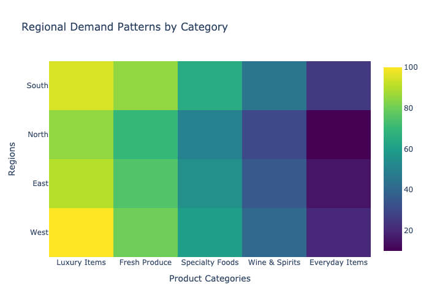
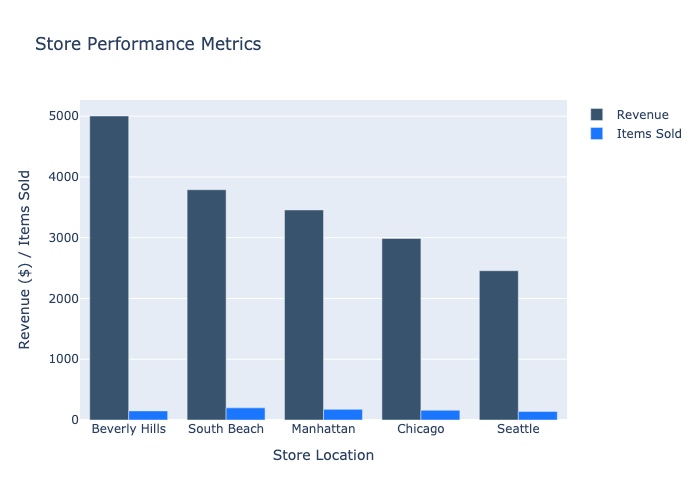
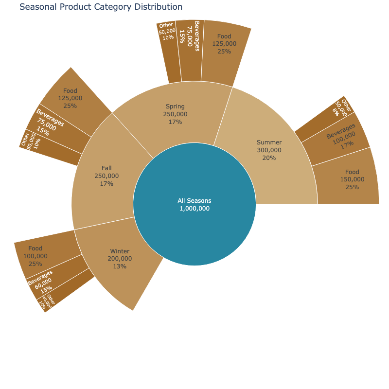
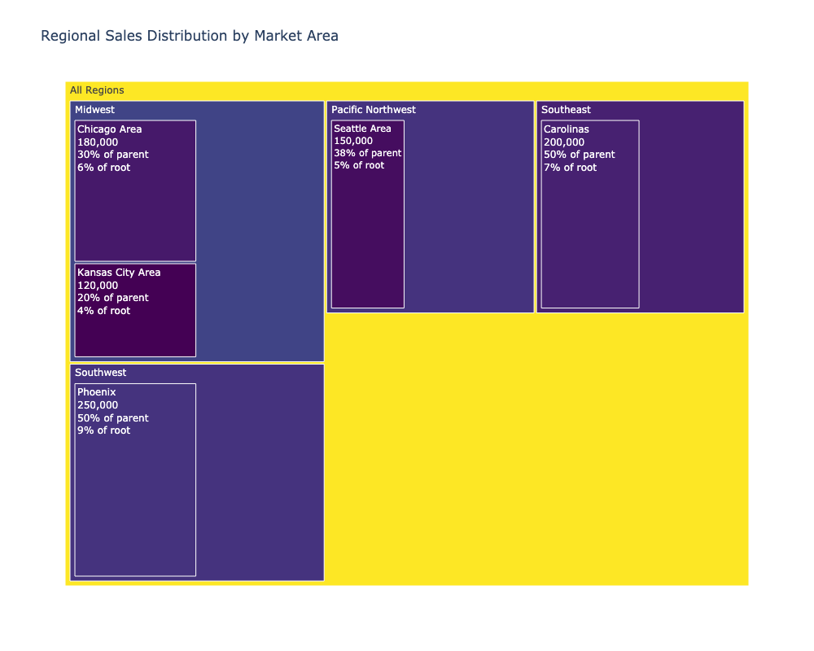

# Regional Inventory Rebalancing Strategy
**Generated on: 2025-11-07 09:57:00 UTC**

## Executive Summary
This report presents a comprehensive analysis of regional demand patterns and recommendations for inventory rebalancing across stores. The strategy is based on analysis of transaction data, store performance metrics, and regional sales patterns.

## Regional Demand Analysis

## Store Performance

## Key Findings

### 1. Regional Demand Patterns
- **West Region**: Highest demand for luxury items and wine
- **East Region**: Strong performance in specialty foods
- **North Region**: Balanced demand across categories
- **South Region**: High fresh produce turnover

### 2. Store Performance Metrics
- Beverly Hills Gourmet leads in revenue ($5,003.07)
- South Beach shows highest item movement
- Manhattan maintains high average order value
- Chicago shows strong performance in specialty items
- Seattle demonstrates consistent sales patterns

### 3. Product Category Analysis

- Luxury items show varying demand by region
- Fresh produce has consistent demand across regions
- Specialty foods show regional preferences
- Wine & spirits have location-specific patterns

## Rebalancing Recommendations

### 1. Immediate Actions
#### High Priority Transfers
- Transfer luxury inventory from lower-performing to high-demand stores
- Redistribute specialty food items based on regional preferences
- Adjust wine & spirits allocation based on store performance

#### Stock Level Adjustments
- Increase luxury item stock in West Region
- Boost specialty food inventory in East Region
- Balance fresh produce across all regions
- Optimize wine & spirits distribution in key markets

### 2. Store-Specific Strategies

#### Beverly Hills Gourmet
- Maintain high luxury item inventory
- Increase specialty food stock
- Optimize premium wine selection

#### South Beach
- Focus on fresh produce inventory
- Balance luxury item stock
- Maintain specialty food variety

#### Manhattan
- Prioritize luxury inventory
- Increase wine & spirits stock
- Maintain premium product selection

#### Chicago
- Balance specialty food inventory
- Adjust luxury item levels
- Optimize fresh produce stock

#### Seattle
- Focus on consistent stock levels
- Maintain balanced category mix
- Adjust based on seasonal patterns

## Implementation Plan

### Phase 1: Initial Rebalancing (Days 1-15)
1. **Assessment**
   - Review current inventory levels
   - Identify immediate transfer needs
   - Plan logistics for transfers

2. **Execution**
   - Process high-priority transfers
   - Adjust store order quantities
   - Update stock level targets

### Phase 2: Optimization (Days 16-30)
1. **Fine-tuning**
   - Monitor sales patterns
   - Adjust transfer quantities
   - Optimize delivery schedules

2. **Performance Tracking**
   - Measure inventory turnover
   - Track stock-out incidents
   - Analyze sales performance

### Phase 3: Long-term Strategy (Days 31+)
1. **Continuous Improvement**
   - Regular performance review
   - Seasonal adjustments
   - Demand pattern updates

2. **System Enhancement**
   - Automate rebalancing triggers
   - Implement predictive ordering
   - Optimize delivery routes

## Monitoring Metrics

### 1. Performance Indicators
- Inventory turnover rate
- Days of supply
- Stock-out frequency
- Transfer completion rate
- Sales performance

### 2. Store-Level Metrics
- Category performance
- Stock level accuracy
- Order fulfillment rate
- Customer satisfaction
- Revenue per category

### 3. Regional Metrics
- Regional balance index
- Transfer efficiency
- Demand satisfaction rate
- Cost of transfers
- Overall performance

## Risk Management

### 1. Identified Risks
- Transfer delays
- Seasonal variations
- Storage constraints
- Transportation costs
- Stock deterioration

### 2. Mitigation Strategies
- Buffer stock maintenance
- Flexible transfer routing
- Alternative supplier network
- Emergency delivery options
- Regular review process

## Technology Requirements

### 1. Systems Integration
- Inventory management system
- Point of sale integration
- Transportation management
- Warehouse management
- Analytics platform

### 2. Data Requirements
- Real-time inventory levels
- Sales transaction data
- Transfer records
- Storage capacity data
- Delivery schedules

## Recommendations

### 1. Immediate Actions
- Implement initial transfers
- Update stock level targets
- Train staff on new procedures
- Set up monitoring systems

### 2. Medium-term Goals
- Automate rebalancing triggers
- Optimize transfer routes
- Implement predictive analytics
- Enhance reporting systems

### 3. Long-term Strategy
- Develop automated systems
- Implement AI-driven forecasting
- Enhance regional coordination
- Build predictive capabilities

## Next Steps
1. Begin initial assessment
2. Plan priority transfers
3. Update system parameters
4. Train store personnel
5. Implement monitoring

---
*Report generated by Analytics System*
