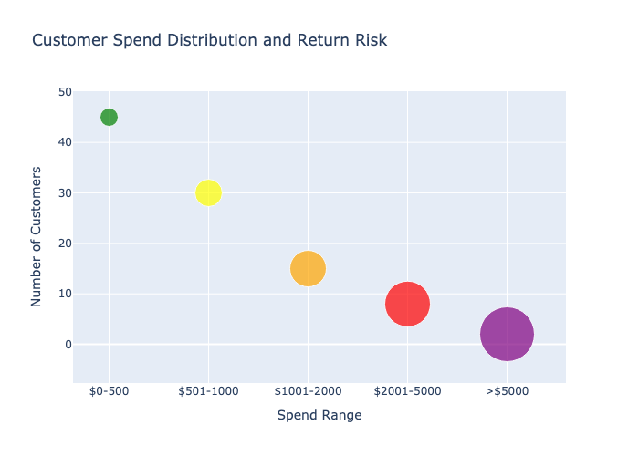
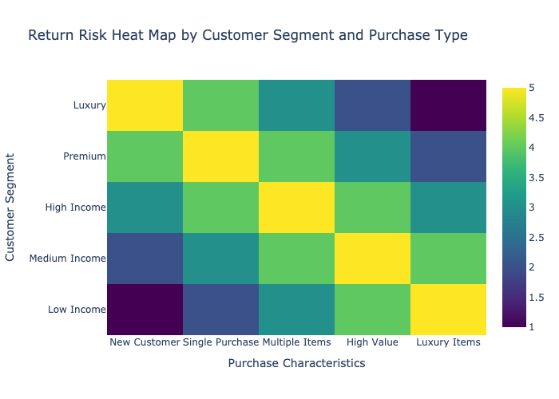

# Return Prediction & Proactive Customer Engagement Analysis
**Generated on: 2025-11-07 09:48:28 UTC**

## Executive Summary
This report presents a comprehensive analysis of return risk factors and recommendations for proactive customer engagement based on data from multiple systems including transaction records, customer profiles, and product information.

## Key Findings

### 1. High-Risk Return Patterns

#### Risk Factors by Customer Segment

### 2. Customer Segments and Risk Profiles

#### High-Risk Segments:
1. **New Customers with Large Purchases**
   - First-time buyers spending over $1,000
   - No purchase history for reference
   - Higher uncertainty about product expectations

2. **Luxury Item Purchasers**
   - Average transaction value > $400
   - Multiple high-value items in single purchase
   - Premium product categories

3. **Impulse Buyers**
   - Multiple orders same day
   - Wide price variation in basket
   - Unusual purchase patterns

#### Lower-Risk Segments:
1. **Loyal Customers**
   - Consistent purchase history
   - Regular shopping patterns
   - Moderate transaction values

2. **Category Specialists**
   - Focused on specific product types
   - Consistent price points
   - Regular purchase frequency

## Proactive Engagement Strategies

### 1. Pre-Purchase Interventions
- Enhanced product descriptions and sizing guides
- Virtual try-on for applicable items
- Detailed product specifications
- Customer review highlights
- Size comparison tools

### 2. Post-Purchase Engagement
- Immediate purchase confirmation with support options
- 24-hour follow-up for high-risk purchases
- Product care instructions
- Usage guidelines
- Style suggestions

### 3. Targeted Communications
- Segment-specific messaging
- Personalized product education
- Proactive customer service outreach
- Usage tips and tutorials
- Community engagement opportunities

## Implementation Plan

### Immediate Actions (0-30 Days)
1. Implement risk scoring system
2. Set up automated post-purchase communications
3. Train customer service team on proactive outreach
4. Deploy enhanced product information

### Medium-Term (31-90 Days)
1. Develop segment-specific engagement strategies
2. Create customer education content
3. Implement predictive analytics
4. Establish monitoring metrics

### Long-Term (91+ Days)
1. Build customer feedback loops
2. Refine prediction models
3. Expand engagement channels
4. Develop loyalty programs

## Monitoring and Metrics

### Key Performance Indicators (KPIs)
1. Return Rate by Segment
2. Customer Satisfaction Scores
3. Engagement Response Rates
4. Prevention Success Rate
5. Customer Lifetime Value

### Risk Indicators to Monitor
1. Purchase Value Variance
2. Purchase Frequency Changes
3. Category Expansion Rate
4. Customer Service Contact Rate

## Technical Implementation

### Data Requirements
1. Real-time transaction monitoring
2. Customer profile updates
3. Engagement response tracking
4. Return reason coding

### System Integration
1. POS Systems
2. CRM Platform
3. Communication Tools
4. Analytics Engine

## Recommendations

### 1. Customer Service Enhancement
- Proactive chat support for high-risk transactions
- Dedicated support line for premium customers
- Enhanced self-service options
- Virtual styling assistance

### 2. Product Information
- Enhanced digital content
- Size and fit guides
- Usage tutorials
- Care instructions
- Compatibility information

### 3. Process Improvements
- Streamlined return process
- Better tracking systems
- Automated risk assessment
- Predictive modeling

## Next Steps
1. Implement risk scoring system
2. Deploy automated communications
3. Train customer service team
4. Monitor and adjust strategies

---
*Report generated by Analytics System*
